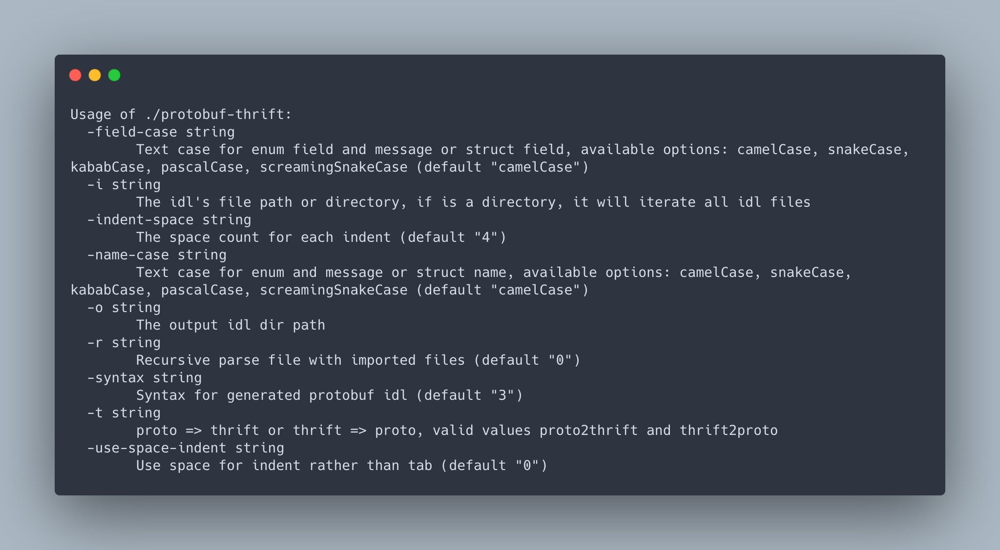

# protobuf-thrift
Little cli utility for lazy guy, transforming protobuf idl to thrift, and vice versa.

> [IDL](https://en.wikipedia.org/wiki/IDL)(Interface description language), which is a descriptive language used to define data types and interfaces in a way that is independent of the programming language or operating system/processor platform.

[中文文档](./docs/cn.md)

## Usages

### Basic Usage
Basic thrift file to protobuf file transform:

```
protobuf-thrift -t thrift2proto -i ./path/to/idl.thrift -o ./idl.proto`
```

Basic protobuf file to thrift file transform:

```
protobuf-thrift -t proto2thrift -i ./path/to/idl.thrift -o ./test.proto`
```

### Interactive Usage

<video src="./docs/interactive.mp4" />

### Case Converting

### Recursive Transforming


## Options



## Caveats

Since protobuf and thrift have many different grammars, we can only transform grammars that have same meaning, e.g. protobuf message => thrift struct, protobuf enum => thrift enum.

Here is a list of transformation rule, so we hope you won't have to worry about protobuf-thrift do sth unexpected.

|protobuf type|thrift type|field type|notice|
|:--:|:--:|:--:|:--:|
|message|struct|optional => optional; repeated T => list\<T\>|only protobuf 2 have optional field|
|map<T1,T2>|map<T1,T2>||T1 only support int32/int64/string/float/double, due to thrift syntax|
|enum|enum|||
|int32|i32|||
|int64|i64|||
|float|double|||
|double|double|||
|bool|bool|||
|string|string|||
|bytes|binary|||
|service|service|rpc => methods||
|constant|const||not support currently|

<!-- * import、package、option、syntax、extend、extension 都被忽略 -->


